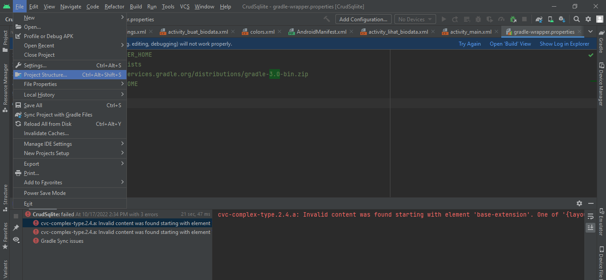
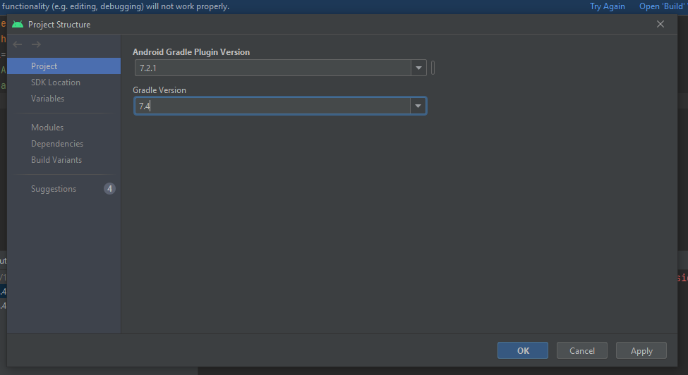
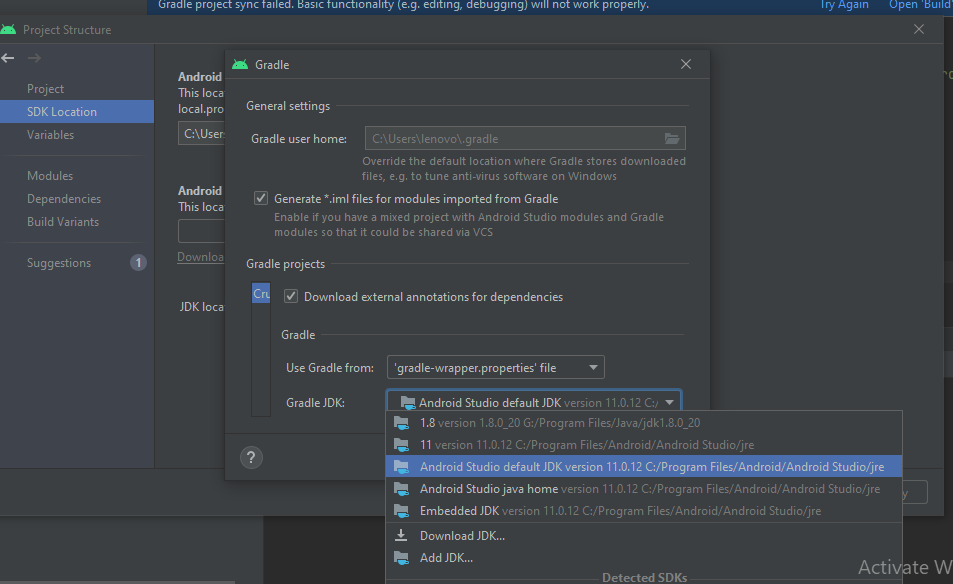
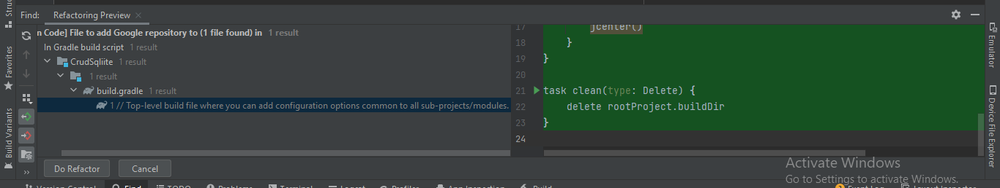
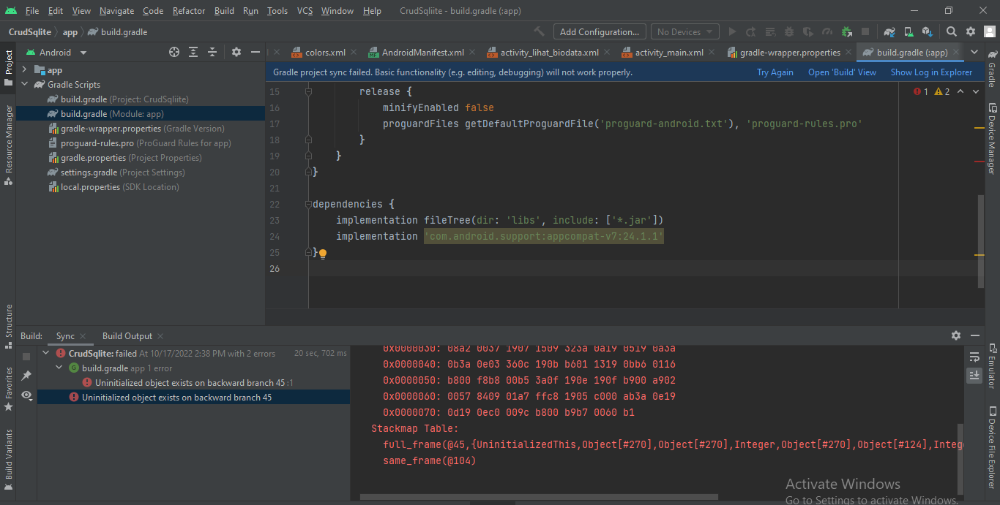
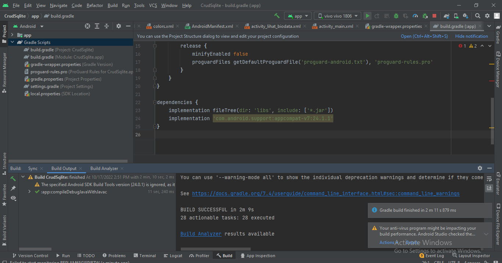
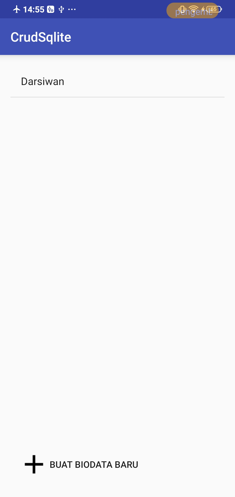

# LAPORAN PRAKTIKUM SQLlite
Nama  : Karmila Novi Arfiana
Kelas : TI-3C
Absen : 12

1. pertama kita mengubah gradle plugin dengan mengeklik project stucture dan pilih pada menu project seperti pada gambar  
  
lalu ganti seperti ini  
  

2. Lalu masuk pada SDK Location, pada langkah ini rubah gradle JDK menjadi android studio default seperti pada gambar dibawah  
  

3. lalu setelah mengganti itu semua akan muncul seprti pada gambar  
  
pada langkah ini klik Do Refactor  

4. maka pada build akan terjadi error dan terdapat tulisan Add google ... klik tulisan tersebut maka akan muncul seperti ini  
  
Hal ini menunjukkan masih terjadi error <b>

5. lalu masuk pada Projec-Gradle Scripts-build.gradle pada file ini rubah kode dependencies seperti berikut  
  
lalu lakukan try again, ketika button run sudah bisa. maka kita coba run  

6. HASIL PRAKTIKUM
  